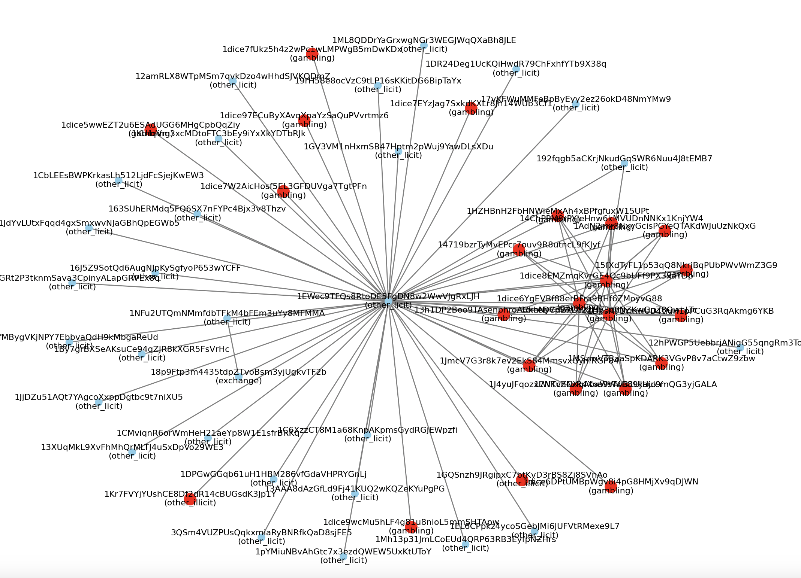

# Automatic Detection of Illicit Activity in Bitcoin

### From Ego-Network Transfer Learning to Full-Graph Temporal Models

---

## Abstract

Social interactions exhibit persistent structural regularities, making them
a natural substrate for learning and generalization in graph-based systems.
In cryptocurrency transaction networks, these regularities manifest as
recurring local interaction patterns associated with illicit activity.

This project studies the automatic detection of illicit behavior in the Bitcoin
transaction graph from two complementary perspectives:

(i) localized structural learning via ego-networks, and  
(ii) scalable full-graph analysis using diffusion and temporal methods.

At the local level, illicit activity is shown to be embedded in cohesive
structures such as chains, star configurations, and triangular motifs.
To capture these patterns, expressive graph neural networks with
3-Weisfeiler–Lehman (3-WL) power are used.

At the global level, scalable approaches such as Personalized PageRank,
temporal diffusion, and Temporal Graph Networks are evaluated.

The results highlight a key limitation of global approaches and show that
illicit activity detection is primarily driven by stable local structural
patterns rather than temporal dynamics.

---

## Problem Setting

We consider a **binary node classification problem**:

- Class 0: licit address
- Class 1: illicit address

Two learning regimes are studied:

1. **Pairwise transfer learning across ego-networks**
2. **Full-graph learning using scalable methods**

---

## Dataset

The dataset is constructed from raw Bitcoin blockchain data.

### Labels

Labels are obtained from:

- public datasets of illicit addresses
- darknet / forum extraction
- LLM-based normalization

---

## Ego-Network Extraction

Ego-networks are constructed using a modified BFS:

- preserves directionality
- maintains local structure
- supports large-scale extraction

Each ego-network is a k-hop subgraph around a labeled node.

These are treated as **independent graph instances**.

---

## Structural Patterns

The following motifs are frequently observed:

- Chains (multi-hop transfers)
- Star structures (centralized distribution)
- Triangles (coordinated interaction)

These patterns are critical for detection and motivate the use of
higher-order models.

---

## Dense Ego-Network Example

  

Dense ego-network with triangular motifs indicating coordinated behavior.

## Models

### 1. GCN (1-WL)

- Standard message passing
- Captures local neighborhood aggregation

### 2. PairGNN (2-WL)

- Captures pairwise interactions
- Limited higher-order awareness

### 3. PPGN (3-WL)

- Captures triangles and higher-order motifs
- Uses second-order representations (n x n)

---

## Transfer Learning Setup

Strict pairwise setting:

- Train on ego-network A
- Test on ego-network B

This simulates distribution shift.

---

## Results (Pairwise Transfer)

| Model          | Precision | Recall | F1-score |
| -------------- | --------- | ------ | -------- |
| PPGN (3-WL)    | 0.15      | 0.83   | 0.26     |
| PairGNN (2-WL) | 0.20      | 0.52   | 0.25     |
| GCN (1-WL)     | 0.62      | 0.78   | 0.64     |

### Interpretation

- PPGN: high recall, low precision
- GCN: best balance
- Higher expressiveness → better structural detection but overfitting

---

## Full-Graph Methods

### Evaluated Approaches

- Personalized PageRank (PPR)
- Temporal PageRank (t-PPR)
- Temporal Graph Networks (TGN)
- Zebra (temporal diffusion + embeddings)

### Key Findings

- Diffusion: high recall, low precision
- Temporal models: high precision, low recall
- No method achieves balance

---

## Key Insight

Illicit activity is primarily a **structural phenomenon**, not a temporal one.

---

## Limitations

- Small ego-networks
- No strict temporal ordering
- High computational cost for PPGN

---

## Future Directions

- Scaling higher-order GNNs
- Temporal ego-network construction
- Hybrid structural-temporal models

---

## Notes

This repository focuses on:

- structural graph learning
- transfer across graphs
- scalability vs expressiveness trade-off
